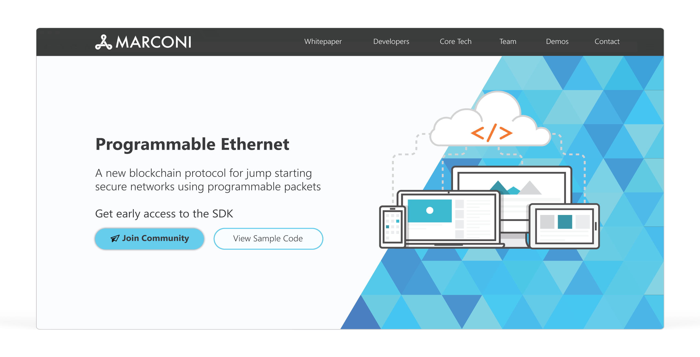

# hw6

Mini-Project for CP1 at CCA FALL2019.

I have been able to build a web page with HTML/CSS into the p5.js editor.

Here is the mockup of the website

Here is the link to the p5.js

https://editor.p5js.org/jaemnkm/sketches/V23NrtrS9
